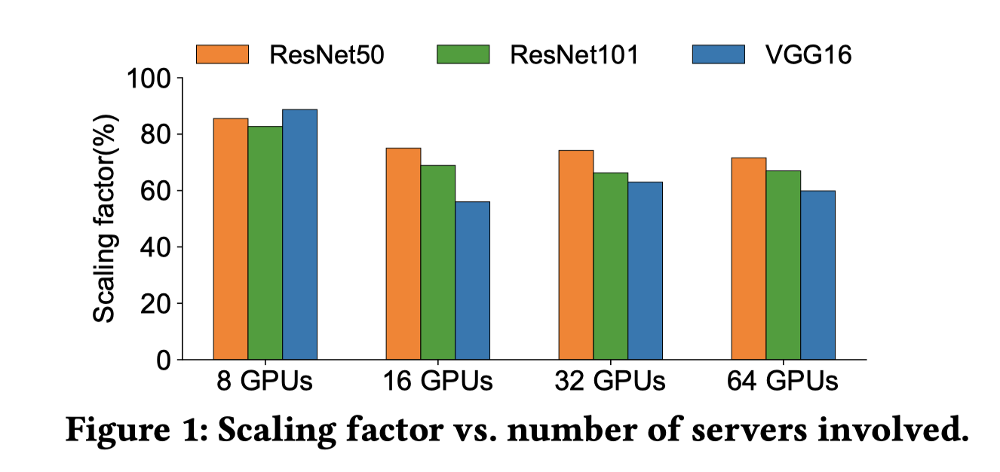

# Is Network the Bottleneck of Distributed Training?
Proceedings of the Workshop on Network Meets AI & ML

- The famous analysis from [OpenAI] [1] shows that the amount of computing needed to train the state-of-the-art model doubles every 3.4 months, while in comparison, the number of transistors on a chip only doubles every 18 months even when Moore’s law is still effective.
- The dream for every scaleout system is linear scalability. That is, given that the throughput of a single device is $T$, the throughput of a system with $n$ devices should be $T$. Let the throughput actually achieved by the system with 𝑛 devices be $T_n$ . We define the scaling factor as 
$$
scaling\ factor = \frac{T_n}{nT}
$$
- Our measurements show that the system can achieve a scaling factor of only 60% with 64 workers (eight servers with eight GPUs each) for VGG16. As expected, the measurement confirms that communication is the component that prevents distributed training from linear scale-out.

- Figure 2 shows the computation time (for the forward and backward pass) for the three models with different number of workers. The computation time keeps almost the same, regardless of the number of workers. The time gap between single GPU and multiple GPUs comes mainly from two factors. First, the runtime for the backward pass in distributed training not only includes backward operations but also the all-reduce operations since they are asynchronous on GPU and overlapped. Whereas, for the single GPU case, there is no all-reduce operation. Second, Horovod injects a hook for each layer in the model during distributed training, which does not exist in single GPU training. However, even considering this computation time gap as an inevitable side effect, the scaling factor should still be bounded around 90% instead of the measured 56%-75%, because the measured computation time increases at most 15% in distributed training. Thus, we argue computation time difference here is not a factor for distributed training not able to scale linearly.

[1]: “AI and Compute.” https://openai.com/blog/ai-and-compute/.
<!--stackedit_data:
eyJoaXN0b3J5IjpbLTg5ODI0NDA4N119
-->